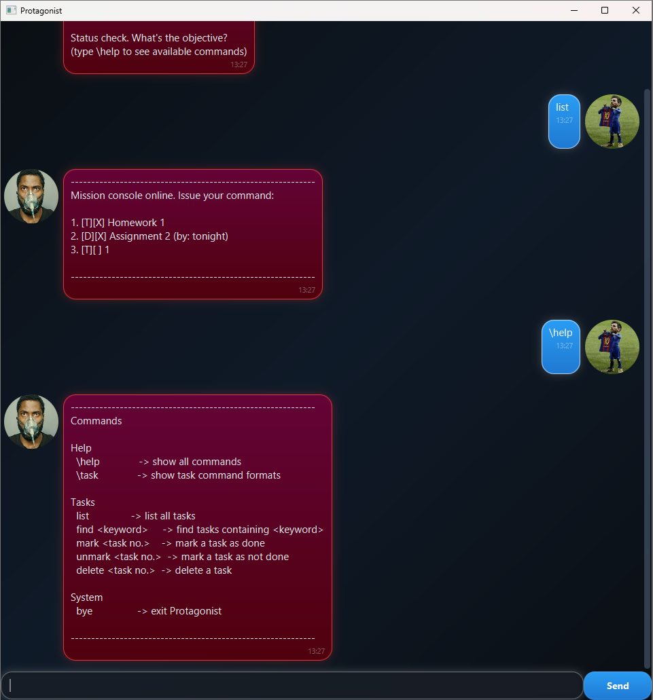

# Protagonist User Guide

**Protagonist** is a command-driven task manager that helps you capture objectives quickly and keep your run organised.
It supports todos, deadlines and timed events, with fast keyword search, numbered task actions (mark, unmark, delete, e.t.c) and clear feedback after every command so you always know what changed and what’s next.

## Quick start

1. Launch the app.
2. Type a command into the input box and press **Enter** (or click **Send**).
3. Use `\help` anytime to see what Protagonist understands.

---

## Commands:

### Help
- `\help` — show all commands
- `\task` — show task command formats and accepted date/time formats

### Tasks
- `list` — list all tasks
- `todo <description>` — add a todo
- `deadline <description> /by <date|datetime>` — add a deadline
- `event <description> /from <date|datetime> /to <date|datetime>` — add an event
- `find <keyword>` — find tasks containing keyword
- `mark <task no.>` — mark a task as done
- `unmark <task no.>` — mark a task as not done
- `delete <task no.>` — delete a task

### System
- `bye` — exit Protagonist

---

## Adding a todo

Adds a task with a description and no date/time.

**Format**
- `todo <description>`

**Example**
- `todo finish homework no.12`

**Expected outcome**
- The todo is added to your list, and Protagonist shows the updated task count.

---

## Adding a deadline

Adds a task that must be completed by a specific date or date-time.

**Format**
- `deadline <description> /by <date|datetime>`

**Examples**
- `deadline return book /by 2026-01-19`
- `deadline submit report /by 2026-01-19T14:20`
- `deadline buy cake /by john's birhtday`

**Expected outcome**
- The deadline is added and displayed with its due date/time.

---

## Adding an event

Adds a scheduled task with a start and end time.

**Format**
- `event <description> /from <date|datetime> /to <date|datetime>`

**Example**
- `event team meeting /from 2026-01-19T14:00 /to 2026-01-19T15:00`
- `event Georgia riots /from today /to tomorrow`

**Expected outcome**
- The event is added and displayed with its time range.

---

## Listing tasks

Displays all tasks currently tracked.

**Format**
- `list`

**Expected outcome**
- Protagonist prints your tasks in a numbered list, so you can refer to them by task number.

---

## Finding tasks

Searches your task list for tasks that contain a keyword.

**Format**
- `find <keyword>`

**Example**
- `find report`
- `find rep`

**Expected outcome**
- Protagonist lists all matching tasks.
- If none match, Protagonist tells you no tasks were found for that keyword.

---

## Marking and unmarking tasks

Updates the completion status of a task by its task number.

**Format**
- `mark <task no.>`
- `unmark <task no.>`

**Examples**
- `mark 2`
- `unmark 2`

**Expected outcome**
- Protagonist prints the updated task entry with its status changed.

---

## Deleting tasks

Removes a task permanently from your list by its task number.

**Format**
- `delete <task no.>`

**Example**
- `delete 3`

**Expected outcome**
- Protagonist confirms removal and shows the updated task count.

---

## Date and time formats

Protagonist accepts:

- `YYYY-MM-DD`  
  Example: `2026-01-19`

- `YYYY-MM-DDThh:mm`  
  Example: `2026-01-19T14:20`

Tip: Use `\task` if you forget the formats.

---

## Error handling

If a command is invalid or incomplete, Protagonist will respond with an error message and a hint on what to do next.
Common examples include:
- unknown commands
- missing required fields (e.g. `/by` not provided for deadline)
- invalid task numbers (e.g. marking a task number that doesn’t exist)
- invalid date/time formats

---
## Command summary

| Action | Format | Example |
|---|---|---|
| Help | `\help` | `\help` |
| Task formats | `\task` | `\task` |
| List tasks | `list` | `list` |
| Add todo | `todo <description>` | `todo finish tutorial sheet` |
| Add deadline | `deadline <description> /by <date\|datetime>` | `deadline submit report /by 2026-01-19T14:20` |
| Add event | `event <description> /from <date\|datetime> /to <date\|datetime>` | `event team meeting /from 2026-01-19T14:00 /to 2026-01-19T15:00` |
| Find tasks | `find <keyword>` | `find report` |
| Mark done | `mark <task no.>` | `mark 2` |
| Unmark | `unmark <task no.>` | `unmark 2` |
| Delete task | `delete <task no.>` | `delete 3` |
| Exit | `bye` | `bye` |

**Accepted date/time formats**
- `YYYY-MM-DD` (e.g. `2026-01-19`)
- `YYYY-MM-DDThh:mm` (e.g. `2026-01-19T14:20`)

## FAQ

**Q: Why do some commands start with `\`?**  
A: `\help` and `\task` are reserved for guidance so they remain easy to access without clashing with task commands.

**Q: How do I see the correct formats again?**  
A: Use `\help` for command list and `\task` for task formats.

---
